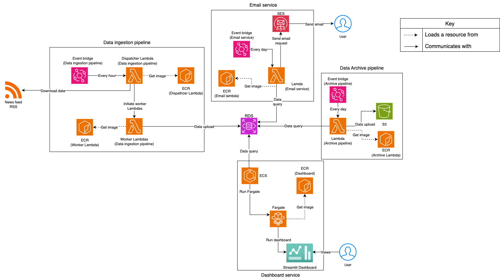

# Architecture

### Architecture Diagram  

**Fig 1**: Cloud Architecture diagram of the implemented services and pipelines.

This data pipeline is designed for efficiency, scalability, and cost-effectiveness using AWS services. EventBridge serves as the central scheduler, triggering key processes at different intervals.

Every hour an EventBridge schedule triggers the dispatcher Lambda which starts the process for the scraper pipeline. This dispatcher Lambda invokes multiple other scraper Lambdas (one for each new outlet) to parallelise the ETL process while keeping the cost similar and decreasing runtime. Lambdas were used over other options like EC2 instances as the pipeline does not always need to be running as we are batch processing the RSS feeds. This is a common theme for all the Lambdas used in this project, as their functionalities are only needed for short times regularly. This pipeline extracts data from the RSS feeds of the news outlets (The Guardian and Daily Express in this case), this data is then cleaned and transformed so analysis can be done. This analysis is then loaded into a RDS hosted on AWS with PostgreSQL which was chosen for its extensiveness, thorough documentation and compatibility with other AWS services used.

Every day, at 9 AM, an EventBridge scheduler invokes the archive Lambda which starts the archive pipeline. The reason for this pipeline is to move old and less relevant data to a more long term storage solution to decrease storage costs of data in the RDS. The long term storage solution is an S3 bucket hosted on AWS.

Every day, at 9 AM, An EventBridge schedule invokes the email Lambda which begins the email service execution. This Lambda uses boto3 and AWS's Simple Email Service (SES) to send a email to subscribed users. This emails contains a PDF attachment of the daily report. This report has a summary and analytics of data from the previous day.

Finally the dashboard website is hosted using an ECS leveraging Fargate. This allows the dashboard to be constantly up to date, available and dynamic. For this dashboard to be more completely dynamic however, the number of maximum tasks should be increased from one and a load balancer should be added for efficiency in the future.

## Directory Structure

The following subdirectories contain Terraform scripts for specific AWS services. Each subdirectory includes a `main.tf` script and a `variables.tf` file, the scripts should be run in the order they appear below:

### **1.RDS**  
[`RDS`](rds/) – Contains Terraform scripts to create and configure an AWS RDS instance with a PostgresSQL engine. For more details, refer to the [RDS README](rds/README.md).

### **2.Schema**  
[`Schema`](schema/) – Contains the SQL schema and ERD diagram of the database used in the project. It also includes utilities such as inputting mock data into an RDS to test the archival and a bash script to reset the database.
For more details, refer to the [Schema README](schema/README.md).

### **3.S3**  
[`S3`](s3/) – Contains Terraform scripts to create and manage an Amazon S3 bucket.
For more details, refer to the [S3 README](s3/README.md).

### **4.ECR**  
[`ECR`](ecr/) – Contains Terraform scripts to create and manage multiple AWS Elastic Container Registry (ECR) repositories.  
For more details, refer to the [ECR README](ecr/README.md).

### **5.Lambda**  
[`Lambda`](lambda/) – Contains Terraform scripts to deploy all the required AWS Lambda functions with associated IAM roles and permissions, making sure the Lambdas can log to CloudWatch.
For more details, refer to the [Lambda README](lambda/README.md).

### **6.Event Scheduler**  
[`Event Scheduler`](event_scheduler/) – Contains Terraform scripts to create and configure AWS EventBridge schedules for the all the Lambdas used in the architecture. It also includes the associated IAM roles and permissions to run their respective Lambda functions.
For more details, refer to the [Event Scheduler README](event_scheduler/README.md).

### **7.ECS**  
[`ECS`](ECS/) – Contains Terraform scripts to provision an AWS Elastic Container Service (ECS) cluster utilising Fargate. Also includes the create of the security group used for the tasks ECS will be running.
For more details, refer to the [ECS README](ecs/README.md).