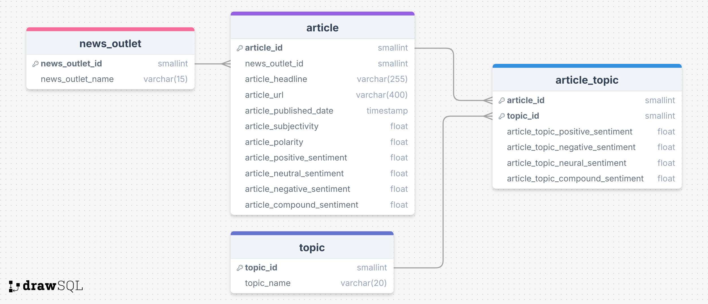

# **Schema Directory - Terraform Configuration**

This directory contains the Schema used to define and seed the remote database as well a ERD diagram shown in **Fig 1**. In addition to this it includes some utilities such as inputting mock data older than three months into the database (so the archive pipeline can be tested) and a bash script that resets the RDS.


Fig 1: Shows the ERD diagram used.

- `ERD.png`: This picture is the ERD diagram and is identical to the structure of the database defined in `schema.sql`.
- `mock_data.py`: Creates mock data so the archive pipeline can be tested.
- `reset_db.sh`: A bash script which connects to and then resets the database by calling the `schema.sql` script.
- `schema.sql`: Contains the schema commands for the database as well as the seeding of tables.
- `topics.csv`: This CSV is used to seed data into the `topic` table.

## **Required Configuration: .env**

The `.env` file is where you provide values for the variables that should be kept a secret but is needed by scripts. In this case the `reset_db.sh` and `mock_data.py` scripts should have these values in order to run correctly.

The `.env` should have these variables along with relevant values:

```
DB_USERNAME=...
DB_PASSWORD=...
DB_NAME=...
DB_HOST=...
DB_PORT=...
```

## **Steps to Run the Terraform Script**

1. **Initialize the Terraform working directory**:
   terraform init
   
2. **Apply the Terraform configuration**:
   terraform apply
   Provide confirmation i.e 'yes' when prompted with: Do you want to perform these actions?